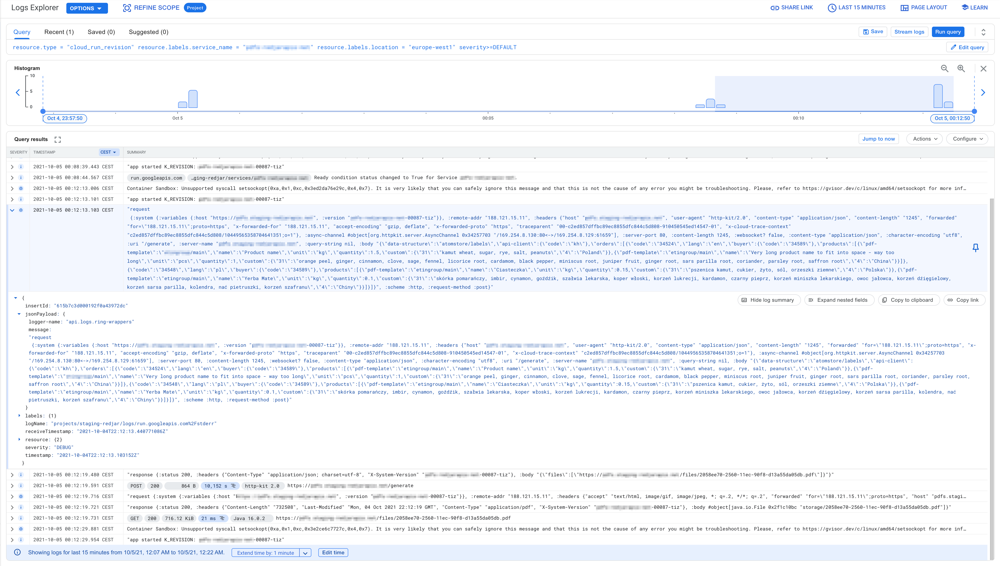
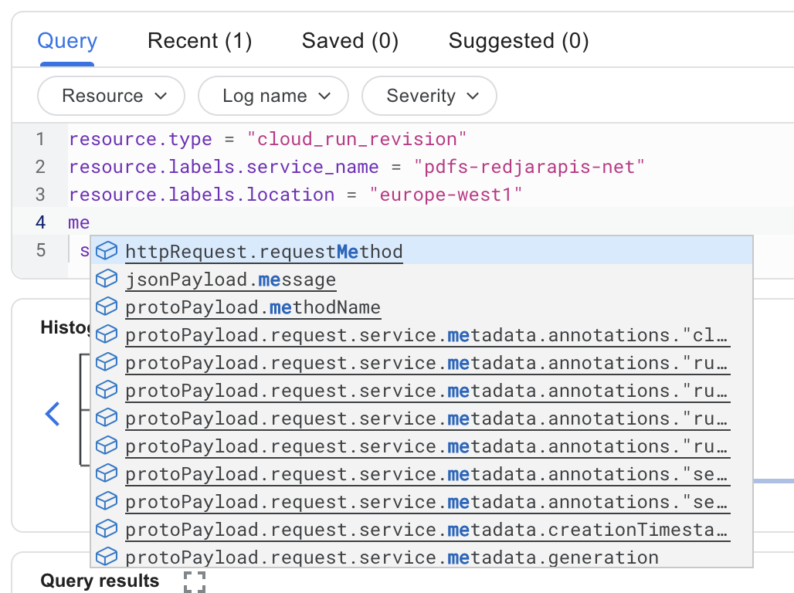
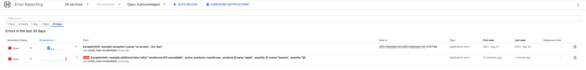
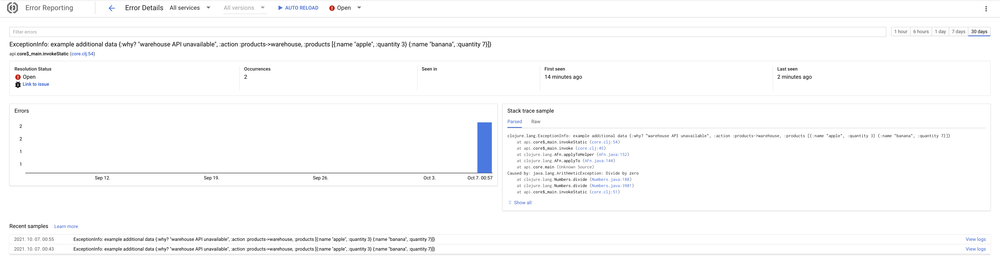
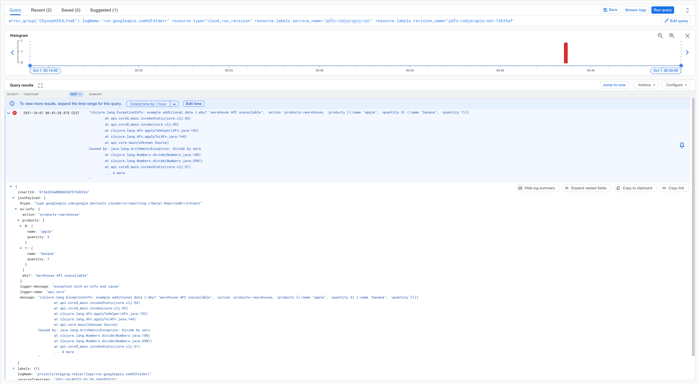

{:date "2021-08-27"
 :title "What are the best DeveOps practices and tools?"
 :tags ["devops" "deployment" "ci/cd" "google cloud" "google cloud run" "docker" "docker compose" "github actions" "kubernetes" "logs" "error reporting"]
 :toc true
 :description "Keep your infrastructure and systems as simple as possible is an advantage over everything else. Save years of your time to find the right solutions. I already did it."
}

Keep your infrastructure and systems as simple as possible is an advantage over everything else. Save years of your time to find the right solutions. I already spent my.

How to design architecture for infrastructure in cloud? Which CI/CD tools to choose? How to test? How to deploy? How to collect logs? How to handle errors? How to make it simple?

<!--more-->

## Rationale

**Keep your infrastructure and systems as simple as possible is an advantage over everything else.** Hold on with extra features - these usually take more, than they give.

This is my greatest lesson from the mistakes I have made. I try to follow this rule of simplicity in IT and all aspects of my live. Complexity is a addicted trap which you desire and can't escape.

This may sound at first glance like one of the many sentences thrown at the show, but it took me many years to understand the power of simplicity in IT. This is the main factor for your success or fail.

In this article I share with you the simplest and the most efficient design of systems and infrastructure I know. I spent a lot of time to research this - I hope you find it valuable.

Disclaimer: I said it is simple, but simple doesn't always mean easy. First you have to learn things like Docker if you don't know them already. But trust me, it is really worth it. Now focus and read it slowly, think about what you are reading.

##  Docker images

**Dockerize everything.**

In my opinion tools like *Heroku*, *AWS Lambda* or *Google Cloud Functions* are artifacts of the past. Today you can dockerize everything making it consistent and being able to run on all machines in the same way. Including software developers computers and different kind of servers.

Today we have solutions like *Google Cloud Run* which let you pay only for time when your system is processing the request or queued items. It means you can use it in similar way as *Google Cloud Functions*, but also for REST API etc. It is designed for stateless and serverless. We will back to *Cloud Run* later in this article.

Advantages of Docker images:
 - Environment is exactly the same on all machines. There is no versions conflict and no breaking changes in environment.
 - You can easy move systems between *AWS*, *Google Cloud* or your own *Kubernetes*. Docker is supported everywhere.
 - You can use the same docker image for different cloud services in the same cloud provider. For example *Cloud Run*, *Cloud App Engine Flexible* and *Google Kubernetes Engine*.
 - Software developers can easy test systems on local machines in consistent way.
 - Software developers can easy set up dependencies on they computer using *docker compose* including databases, your other services etc. Each developer can set up the environment by one command `docker compose up`. I will extend this topic very soon.
 - You are sure you deploy to production exactly the same version of the system which you tested on staging environment.

[Dockerfile documentation](https://docs.docker.com/engine/reference/builder/)

### Multi-stage builds Dockerfile

**Always use multi-stage builds.** Multi-stage builds let's you build docker images in more efficient way.

Advantages of multi-stage builds Dockerfile:
- cache stages to build faster next time
- no tests artifacts in final image
- consistent way of testing in CI/CD and developers computers
- it is technically impossible to deploy by mistake system for which tests failed, because docker image will be never build then (fail on tests or build stage).
- easy use in CI/CD tool and migration to different one, because you have to focus only on building docker image without rewriting code for specific CI/CD tool. It makes developing CI/CD flow and builds easier when you can run most of the flow on developers computers by `docker build` command.

```dockerfile
# Environment deps
# Prepare linux system with dependencies
FROM clojure:openjdk-14-tools-deps-1.10.1.727-slim-buster as env
WORKDIR /app
RUN apt-get update && apt-get --no-install-recommends -y install chromium && rm -rf /var/lib/apt/lists/*
COPY ./resources/fonts/* /usr/local/share/fonts/
RUN fc-cache -v

# Environment + clojure dependencies
# Download all dependencies for your software.
# This is important stage to cache, because it takes always a long time.
# COPY only files needed to download dependencies for your software.
FROM env as env-with-clj-deps
COPY deps.edn .
RUN clojure -A:uberjar:tests-deps:check-syntax-and-reflections:run-tests -Stree

# Full image ready to compile and tests
# From that moment source code files will be always different.
# It means we can't use cache for next builds.
FROM env-with-clj-deps as deps-with-code
COPY . .

# Tests
FROM deps-with-code
RUN clojure -A:tests-deps:check-syntax-and-reflections
RUN clojure -A:tests-deps:run-tests

# Compile the code
# We don't want to have tests artifacts.
# We use deps-with-code stage (not tests stage).
FROM deps-with-code as builder
RUN clojure -Spom
RUN clojure -X:uberjar

# Final
# The final docker image with only needed things without artifacts.
# We use env stage and copy from builder stage.
FROM env
EXPOSE 80
COPY --from=builder /app/api.jar ./
CMD ["java", "-XX:InitialRAMPercentage=70", "-XX:MaxRAMPercentage=70", "-Dclojure.tools.logging.factory=clojure.tools.logging.impl/jul-factory", "-jar", "api.jar"]
```

The example above is specific for *Clojure* programming language. But the point is stages will be the same for other languages: add linux dependencies -> add software dependencies -> copy software source code -> tests -> build the software -> final image.

**tutorial step:**

Prepare Dockerfile for your simplest "Hello World" HTTP request->response system in your favorite programming language.

[multi-stage builds documentation](https://docs.docker.com/develop/develop-images/multistage-build/)

### Docker Compose for developing

**Always use Docker Compose to set up dependencies for developing.**

Use *Docker Compose* to set up developers environment on they computers and to set up dependencies for testing in CI/CD.

Advantages of Docker Compose:
- easy start for a new team member to set up environment, just run `docker compose up`
- all developers use the same environment and versions to develop software
- no conflicts between versions on different developers computers
- no conflicts between versions for different projects
- consistence, the same method of running everywhere for everything
- documentation about dependencies as a code
- when you are developing frontend you can add backend system (or vice versa) for tests
- different projects don't conflict each other changing databases state
- easy to restart entirely databases to fresh state

```yaml
version: '3.7'
services:
  redis:
    image: redis
    ports:
    - 6379:6379
  mongodb:
    image: mongo:3.6
    ports:
    - 27017:27017
  mysql:
    image: mysql:5.5
    environment:
    - MYSQL_ALLOW_EMPTY_PASSWORD="true"
    ports: 
    - 3306:3306
    - 33060:33060
    - 33062:33062
```

The example above run dependencies like *Redis* database in *Docker* containers and forward ports on your computer to this containers. *In other words you can use all this services as you would install them directly on your computer*.

**tutorial step:**

Make a *Docker Compose* for your "Hello World" system dependencies. Just add a *Redis* or *Postgresql* to see it works and became confident.

[Docker Compose documentation](https://docs.docker.com/compose/)

## CI/CD

I did a long research about CI/CD tools. To keep it short there are a few issues:
- unnecessary complexity of coding pipeline steps
- if you choose to host CI/CD on your own you will have to deal with breaking changes when update CI/CD software
- bugs
- luck of integrations
- luck of support

Sounds general, but this things are very frustrating, time consuming and increase complexity. Just don't do this yourself. Use SaaS and pay for it. You want to focus on your software.

**I recommend to use *GitHub Actions* or *Cloud Build*.** Both are the best choice. Time have changed. Really a few years ago I would write something else, but today there is no point to use tools of the past.

###  GitHub Actions

Use it because your probably already use GitHub and this is simple and good solution. It contains all you can need. I don't know any better. I recommend to use it on the first place and switch to *Cloud Build* if you will find yourself, it will be simpler in some corner use cases.

[GitHub Actions documentation](https://docs.github.com/en/actions)

###  Native cloud solution

Personally so far I use *Cloud Build* for *Cloud Run* projects. *Cloud Run* needs *Docker* image in *Google Container Registry*. It can be done in *GitHub Actions* but needs extra setup for security and access. It is really not a big deal, but I feel comfortable with *Cloud Build* too.

*Cloud Build* and *Google Container Registry* are also cheaper, than what *GitHub* offer, but make it the least important factor to make a choice.

Equivalent of *Google Cloud Build* in *AWS* is *CodeBuild*.

[Cloud Build documentation](https://cloud.google.com/build)

[CodeBuild documentation](https://aws.amazon.com/codebuild/)

**tutorial step:**

Use *GitHub Actions* to test and build your project using Dockerfile for each commit to master. We will deploy it to server in another step.

## Cloud infrastructure

Now it is time to choose the specific service offered in clouds to run your software.

###  (not) Kubernetes


*Kubernetes* is much harder and complex, than they advertise it. Not because of the maintenance of *Kubernetes* itself, but also or rather mainly because of tools around which you will have to use. Don't get me wrong. *Kubernetes* is a great tool. But it is simpler to use *Cloud Run*.

If you decide to use *Kubernetes* anyway I can recommend [ArgoCD](https://argoproj.github.io/argo-cd/) as a GitOps continuos delivery tool for *Kubernetes*. I did a solid research and this is the only one tool which is really good. At least in my preference.

GitOps - git as a source of true. Keep your infrastructure and deployments configuration as a code in git repository. Changing the git repository causes the auto update in *Kubernetes*.

###  Google Cloud

I prefer *Google Cloud*, because I found it simpler and better documented. While google maybe offer less services, than *AWS*, at the same time this services are really good and you don't need anything else. Because of that I have simple choices to make and I don't feel *AWS* can offer me something better.

####  Cloud Run

Cloud Run concept:
1. You pay only for time when your software processing request or queue item. In consequence your software has to be stateless.
1. System can't keep state from previous request for next request. To keep state use databases. For example if you want to keep user sessions you can use *Redis*.
2. The consequence of paying only during processing is no access to CPU outside of the request->response flow. For example REST API get request, your system process it and return the response. From that moment cloud cut access to CPU. But if you want to do side effects which don't delay the response you can add them to *cloud Pub/Sub* during processing.
3. Systems are deployed to machines with RAM and CPU which you choose. You don't have to manage servers at all - really.
4. You can use *Cloud Run* for request->response, Pub/Sub (queue) or scheduler jobs.
5. While you pay only for processing time this cut costs a lot.
6. You can keep minimum instances always running for immediate response and set maximum instances to scale in a few seconds.
7. One instance can processing up to 1000 requests / queue items at the same time. It is not like in *Cloud Functions* with concurrency equal 1.

Let's stop for a while here and think about it. The concept of stateless and serverless is actually the right one for all systems and especially for scalable systems. It is not like you can't do something here. It is only matter of choices which you have to make for your systems architecture. I would say it should be possible to use only *Cloud Run* for almost everything.

While it can sounds scary about CPU access, **stateless and serverless is exactly the architecture which you want to have**. Trust me, it is really worth to use *Cloud Run* on the first place.

####  Cloud App Engine Flexible

If for some reason you want to have always running instances you can use *Google Cloud App Flexible*. You will always have access to CPU and can keep state. But here is the point: you can use exactly the same docker image. You only deploy to other cloud service.

#### Cloud Run vs Cloud App Engine Flexible

|           | Cloud Run                             | Cloud App Engine Flexible                     |
|-----------|---------------------------------------|-----------------------------------------------|
| **state** | stateless - can't keep state          | can keep state                                |
| **cost**  | cheaper: pay only for processing time | more expensive: pay for instance running time |

 You can think about *Cloud App Engine Flexible* as *Cloud Run*, but your software can keep state and have access to CPU all the time, so standard fully operational instance. In consequence you pay more, because for full time instance running 24h. For *Cloud Run* you pay only for processing time, but not for idle time.

###  AWS

I don't have as good experience in *AWS* as in *Google Cloud* infrastructure to be confident to write about deep details. I am sorry. As far as I know *Cloud Run* equivalent is *AWS App Runner* and *Cloud App Engine Flexible* is *AWS Elastic Beanstalk*. But these services are still different in details. For example you can't set *AWS App Runner* to minimum 0 instances while you can do it in *Cloud Run*. You can't use *AWS App Runner* as replacement for *AWS Lambda* considering costs. This matter for small projects and limited budget. Another thing is limited CPU / memory choice in *AWS App Runner* comparing to *Google Cloud Run*.

## Logs

**Master cloud logging instead of using external tools**. Cost of increasing complexity is not worth it. Today cloud logging is really good.

In this chapter I will focus only on *google cloud*, because I have deeper experience here and have easy to make examples.

###  Logging

[](google-logging.png)

^ Example of JSON request to generate PDFs for label printers.

Data can be logged by your software as a JSON structure, but don't have to. You can use logging as a string in stdout / stderr. The advantage of JSON is easier way to query logs, browse them and copy & paste to recreate issues. The disadvantage is you have to do one time extra work in your coding language to figure out how to change logging to *Google jsonPayload* format.

(some fields are pixelate, because I wanted to hide some data)

To make it vivid here is an example of *clojure* language exception:

```clojure
(try
    (throw
      (ex-info "exception info" {:custom-data "extra data to debug and recreate the issue"}))
    (catch Exception e
      (l/error e "exception test with ex-info")))
```

Pay attention to `custom-data`.

*Google jsonPayload* format:

```json
{
    "severity": "SEVERE",
    "logger-name": "api.logs.google-json-payload",
    "message": "clojure.lang.ExceptionInfo: exception info {:custom-data \"extra data to debug and recreate the issue\"}\n\tat api.logs.google_json_payload$eval8584.invokeStatic(google_json_payload.clj:3)\n\tat api.logs.google_json_payload$eval8584.invoke(google_json_payload.clj:121)\n\tat clojure.lang.Compiler.eval(Compiler.java:7177)\n\tat clojure.lang.Compiler.eval(Compiler.java:7132)\n\tat clojure.core$eval.invokeStatic(core.clj:3214)\n\tat clojure.core$eval.invoke(core.clj:3210)\n\tat nrepl.middleware.interruptible_eval$evaluate$fn__936.invoke(interruptible_eval.clj:91)\n\tat clojure.main$repl$read_eval_print__9086$fn__9089.invoke(main.clj:437)\n\tat clojure.main$repl$read_eval_print__9086.invoke(main.clj:437)\n\tat clojure.main$repl$fn__9095.invoke(main.clj:458)\n\tat clojure.main$repl.invokeStatic(main.clj:458)\n\tat clojure.main$repl.doInvoke(main.clj:368)\n\tat clojure.lang.RestFn.invoke(RestFn.java:1523)\n\tat nrepl.middleware.interruptible_eval$evaluate.invokeStatic(interruptible_eval.clj:84)\n\tat nrepl.middleware.interruptible_eval$evaluate.invoke(interruptible_eval.clj:56)\n\tat nrepl.middleware.interruptible_eval$interruptible_eval$fn__962$fn__966.invoke(interruptible_eval.clj:155)\n\tat clojure.lang.AFn.run(AFn.java:22)\n\tat nrepl.middleware.session$session_exec$main_loop__1063$fn__1067.invoke(session.clj:190)\n\tat nrepl.middleware.session$session_exec$main_loop__1063.invoke(session.clj:189)\n\tat clojure.lang.AFn.run(AFn.java:22)\n\tat java.base/java.lang.Thread.run(Thread.java:831)\n",
    "ex-info": {
        "custom-data": "extra data to debug and recreate the issue"
    },
    "@type": "type.googleapis.com/google.devtools.clouderrorreporting.v1beta1.ReportedErrorEvent",
    "logger-message": "exception test with ex-info"
}
```

Standard string output:

```java
Oct 08, 2021 3:38:44 PM clojure.tools.logging$eval1809$fn__1812 invoke
SEVERE: exception test with ex-info
clojure.lang.ExceptionInfo: exception info {:custom-data "extra data to debug and recreate the issue"}
	at api.logs.google_json_payload$eval8574.invokeStatic(google_json_payload.clj:3)
	at api.logs.google_json_payload$eval8574.invoke(google_json_payload.clj:121)
	at clojure.lang.Compiler.eval(Compiler.java:7177)
	at clojure.lang.Compiler.eval(Compiler.java:7132)
	at clojure.core$eval.invokeStatic(core.clj:3214)
	at clojure.core$eval.invoke(core.clj:3210)
	at nrepl.middleware.interruptible_eval$evaluate$fn__936.invoke(interruptible_eval.clj:91)
	at clojure.main$repl$read_eval_print__9086$fn__9089.invoke(main.clj:437)
	at clojure.main$repl$read_eval_print__9086.invoke(main.clj:437)
	at clojure.main$repl$fn__9095.invoke(main.clj:458)
	at clojure.main$repl.invokeStatic(main.clj:458)
	at clojure.main$repl.doInvoke(main.clj:368)
	at clojure.lang.RestFn.invoke(RestFn.java:1523)
	at nrepl.middleware.interruptible_eval$evaluate.invokeStatic(interruptible_eval.clj:84)
	at nrepl.middleware.interruptible_eval$evaluate.invoke(interruptible_eval.clj:56)
	at nrepl.middleware.interruptible_eval$interruptible_eval$fn__962$fn__966.invoke(interruptible_eval.clj:155)
	at clojure.lang.AFn.run(AFn.java:22)
	at nrepl.middleware.session$session_exec$main_loop__1063$fn__1067.invoke(session.clj:190)
	at nrepl.middleware.session$session_exec$main_loop__1063.invoke(session.clj:189)
	at clojure.lang.AFn.run(AFn.java:22)
	at java.base/java.lang.Thread.run(Thread.java:831)
```

---

[](google-logging-query.png)

^ Writing queries is easy, because of the helpers.

###  Error Reporting

Errors in your software logs are detected and reported in special way.

[](google-error-reporting-list.png)

^The list of errors. You can resolve / acknowledged / mute them.

When new error occur you can be informed by e-mail with a link to details.

---

[](google-error-reporting-detail.png)

^ Error detail

Detail about an error. You can click "View logs" to open logs for a specific occur of error in time.

---

[](google-error-reporting-logs.png)

^ Detailed logs for error

This is the most detailed view. Notice the `ex-info` which contain custom data included by my software to help me figure out what happen. This is a simple example, but you can include in logs client request to your API, warehouse API response, X-Correlation-ID HTTP header and data about products in your software. This is very useful for debugging and recreating the issue - there is "copy to clipboard" button which copy the JSON data. You can also query logs using this fields.

**You can add whatever data you want to all logs. Not only to error reporting, but here it is the most useful. You can easy copy & paste data to recreate the error.**

## The final ultimate solution

This is my recommendation:

-  test and build using Dockerfile
-  *Docker Compose* for your project third party dependencies
-  /  CI/CD: *GitHub Actions* or alternatively *Google Cloud Build*
-  /  deploy to *Google Cloud Run* or alternatively *Cloud App Engine Flexible*
-  *Google Logging* - log in Google Cloud Run as a JSON or string to stdout / stderr. No extra google dependencies in your software are needed to parse JSON by *google logging*.
-  *Google Error reporting* - while you use *Google Logging* you already have *Error Reporting*.

Let me make sure you understand point of the simplicity here:
1) You don't have to manage servers. You only tell *Cloud Run* which docker image to run.
2) You don't need any extra library in your software to run your software in cloud. You can run anything as always in docker image.
3) You don't need extra tools and libraries for logging. Just use stdout / stderr and *Cloud Run* will parse it. If you will print logs as *google jsonPayload* structure you can achieve even more. *Cloud Run* can parse JSON from stdout / stderr without any extra configuration.
4) You don't need any extra tools and dependencies for *Errors Reporting*. You see all your systems errors in *Error Reporting*.
5) You don't have to maintenance your own CI/CD tool.
6) You can significantly decrease number of experts and scope of skills needed in your team.

**So, you can focus mainly on coding your software.**

Only one thing which you have to do is design your architecture to make your software serverless and stateless. It is the best choice which you can make anyway. The reward is huge: simplicity and focus on right things.

## FAQ

**Does this solution fit for everything?**

For sure not, but I would say in 99% cases it will be the best choice. If you are in this 1% other needs you know this. If you don't, then you are in this 99% and can use it.

**Can I use this for my old software?**

There is a high chance you can't, because you don't use Docker and your application is not 100% stateless. You will have to refactor many things. But if you have time for that or your software is well designed already go for it. You will learn a lot from this.

**What about infrastructure as a code?**

This is a great idea. I am totally for it. Unfortunately so far with such simple infrastructure as I prefer I found it more frustrating, than helpful. I realized I love idea how it can work, but hate how it really works. I found tools like *Terraform* or *Google Cloud Deployment Manager* having not fully covered integrations and a few but very frustrating issues. I will definitely back to the topic. Maybe it works better today, than last time when I checked. I hope so. Today I use it partially.

**What about external API tools tests like Postman for automated tests?**

Don't use them. A few real examples of Postman issues:

- UI limits feedback readability why something failed. People copy and paste complex HTTP response to editor to parse it in readable way.
- People have to learn and maintenance additional tools. You need to increase your team size about people with Postman experience.
- People have different version of Postman on they computers and this sometimes make tests not work, because of breaking changes in new versions.
- Rewrite part of the code, because of new ver. Postman is out and there are breaking changes.
- bugs in this tools, for example Postman have all the time bug about cache IP for domains. This is the issue when you use VPN, which change the IP of the domain. If you run tests before connect to VPN Postman will cache IP. Then you connect to VPN and there is a new IP, but Postman will still use the old one. For Postman team this bug is very low priority, because it is rare use case and they do nothing to fix it for years. Unfortunately it was the case in my work and we had to deal with it. We spent days to debug why Postman tests fail for random people in random situations.

This are things which we have to deal all the time with all kind of dedicated User Interface tools for tests. Personally I recommend to write tests in your core coding language. In my case it is *Clojure* coding language. I prefer to make a separate tests which I run external in docker image to make HTTP requests and verify responses. Then I am sure software work on stating / production. Tests can be written in the same project or as a separate one for complex requests between many services.

In that way I keep things simple, stable and narrow scope of the skills I need. I can code great tests easy, because I use my core language - the same which I use to develop software which I want to test. Writing tests in your core language is a pleasure versus writhing them in frustrating limited tools, which you are not truly interested in to be an expert. Also in my opinion dedicate tests for command line instead of UI is much more powerful.